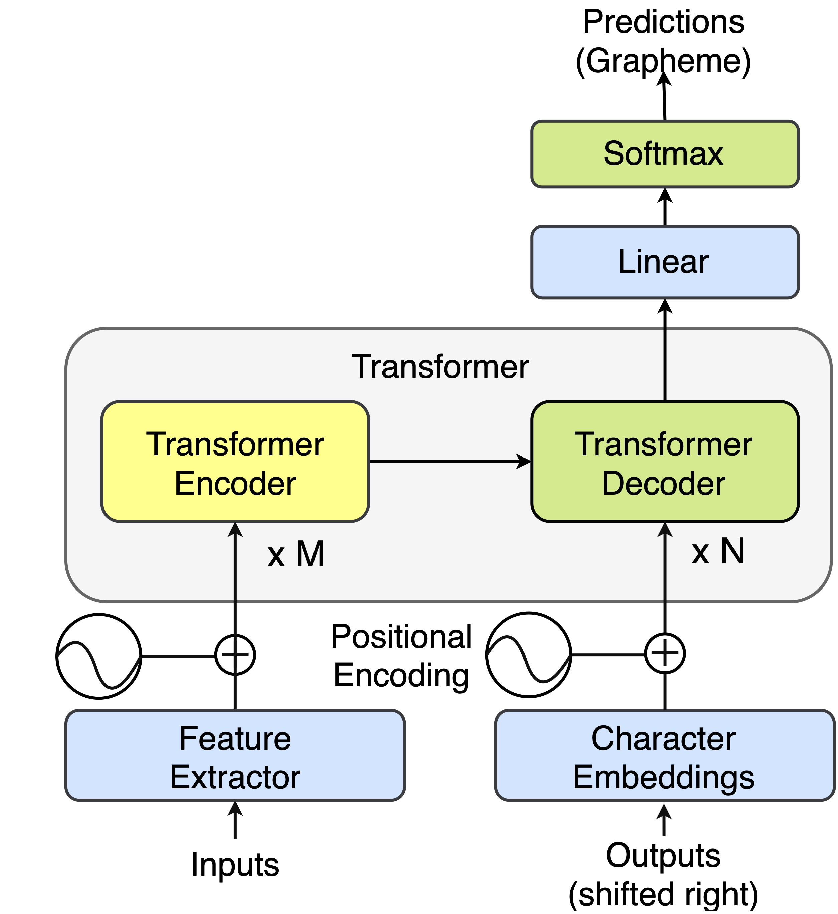

## Learning Fast Adaptation on Cross-Accented Speech Recognition
### Genta Indra Winata, Samuel Cahyawijaya, Zihan Liu, Zhaojiang Lin, Andrea Madotto, Peng Xu, Pascale Fung

 [](https://opensource.org/licenses/MIT) 

This is the implementation of our paper accepted in Interspeech 2020 and the pre-print can be downloaded [here] (https://arxiv.org/pdf/2003.01901.pdf).

This code has been written using PyTorch. If you use any source codes or datasets included in this toolkit in your work, please cite the following paper.
```
@article{winata2020learning,
  title={Learning fast adaptation on cross-accented speech recognition},
  author={Winata, Genta Indra and Cahyawijaya, Samuel and Liu, Zihan and Lin, Zhaojiang and Madotto, Andrea and Xu, Peng and Fung, Pascale},
  journal={arXiv preprint arXiv:2003.01901},
  year={2020}
}
```

## Abstract
Local dialects influence people to pronounce words of the same language differently from each other. The great variability and complex characteristics of accents creates a major challenge for training a robust and accent-agnostic automatic speech recognition (ASR) system. In this paper, we introduce a cross-accented English speech recognition task as a benchmark for measuring the ability of the model to adapt to unseen accents using the existing CommonVoice corpus. We also propose an accent-agnostic approach that extends the model-agnostic meta-learning (MAML) algorithm for fast adaptation to unseen accents. Our approach significantly outperforms joint training in both zero-shot, few-shot, and all-shot in the mixed-region and cross-region settings in terms of word error rate.

## Download data
Execute the following command from the base folder
```
cd data && bash download_cv2.sh
```

## Setup Requirement
- Install PyTorch (Tested in PyTorch 1.0 and Python 3.6)
- Install library dependencies (requirement.txt)

## Model


## Run the code
### Configuration
- train-manifest-list: a list of training csv
- valid-manifest-list: a list of valid csv
- test-manifest-list: a list of test csv
- labels-path: a vocabulary list
- k-train: number of training samples per batch (or in the meta-train inner loop in MAML)
- k-valid: (only for MAML) number of meta-validation samples per batch
- save-folder: the location of the saved models
- feat_extractor: the module to generate audio input features (vgg)
- train-partition-list: to set the data percentage

### Train from scratch
You can train a model from scratch using the following arguments:

#### Train a model with joint-training objective
```
python joint_train.py
--train-manifest-list ./data/manifests/cv_20190612_wales_train.csv
--valid-manifest-list ./data/manifests/cv_20190612_wales_test.csv
--test-manifest-list ./data/manifests/cv_20190612_wales_test.csv
--cuda --k-train 6 --labels-path data/labels/cv_labels.json --lr 1e-4 --name wales_enc2_dec4_512_b6 --save-folder save/ --save-every 10000 --feat_extractor vgg_cnn --dropout 0.1 --num-enc-layers 2 --num-dec-layers 4 --num-heads 8 --dim-model 512 --dim-key 64 --dim-value 64 --dim-input 5120 --dim-inner 512 --dim-emb 512 --early-stop cer,20 --src-max-len 5000 --tgt-max-len 2500 --evaluate-every 1000 --epochs 500000 --sample-rate 16000 --train-partition-list 1
```

#### Train a model with first-order MAML objective
```
python meta_train.py
--train-manifest-list ./data/manifests/cv_20190612_us.csv ./data/manifests/cv_20190612_england.csv ./data/manifests/cv_20190612_indian.csv ./data/manifests/cv_20190612_australia.csv ./data/manifests/cv_20190612_newzealand.csv ./data/manifests/cv_20190612_african.csv ./data/manifests/cv_20190612_ireland.csv ./data/manifests/cv_20190612_hongkong.csv ./data/manifests/cv_20190612_malaysia.csv ./data/manifests/cv_20190612_singapore.csv
--valid-manifest-list ./data/manifests/cv_20190612_canada.csv ./data/manifests/cv_20190612_scotland.csv ./data/manifests/cv_20190612_southatlandtic.csv
--test-manifest-list ./data/manifests/cv_20190612_philippines.csv ./data/manifests/cv_20190612_wales.csv ./data/manifests/cv_20190612_bermuda.csv
--cuda --k-train 6 --k-valid 6 --labels-path data/labels/cv_labels.json --lr 1e-4 --name maml_10_3_3_enc2_dec4_512_b6_copy_grad --save-folder save/ --save-every 10000 --feat_extractor vgg_cnn --dropout 0.1 --num-enc-layers 2 --num-dec-layers 4 --num-heads 8 --dim-model 512 --dim-key 64 --dim-value 64 --dim-input 5120 --dim-inner 512 --dim-emb 512 --early-stop cer,50 --src-max-len 5000 --tgt-max-len 2500 --evaluate-every 100 --epochs 500000 --sample-rate 16000 --copy-grad --num-meta-test 10
```

### Fine-tune a trained model
You can pre-train the model with other datasets and fine-tune the trained model. 

#### Fine-tune a trained model with MAML objective.
```
python finetune.py
--train-manifest-list ./data/manifests/cv_20190612_philippines_train.csv
--valid-manifest-list ./data/manifests/cv_20190612_philippines_test.csv
--test-manifest-list ./data/manifests/cv_20190612_philippines_test.csv
--train-partition-list 0.1
--cuda --k-train 6 --labels-path data/labels/cv_labels.json --lr 1e-4 --name multi_accent_finetune_10shot_5updates_philippines_maml_10_3_3_enc2_dec4_512_b6_copy_grad_early10000 --save-folder save/ --feat_extractor vgg_cnn --dropout 0.1 --num-enc-layers 2 --num-dec-layers 4 --num-heads 8 --dim-model 512 --dim-key 64 --dim-value 64 --dim-input 5120 --dim-inner 512 --dim-emb 512 --early-stop cer,50 --src-max-len 5000 --tgt-max-len 2500 --epochs 5 --sample-rate 16000 --continue-from save/maml_10_3_3_enc2_dec4_512_b6_copy_grad_early10000/epoch_220000.th --beam-search --beam-width 5 --save-every 5 --opt_name sgd --evaluate-every 5 &
```

#### Fine-tune a trained model with joint-training objective
```
python finetune.py
--train-manifest-list ./data/manifests/cv_20190612_philippines_train.csv
--valid-manifest-list ./data/manifests/cv_20190612_philippines_test.csv
--test-manifest-list ./data/manifests/cv_20190612_philippines_test.csv
--train-partition-list 0.1
--cuda --k-train 6 --labels-path data/labels/cv_labels.json --lr 1e-4 --name multi_accent_finetune_10shot_5updates_philippines_joint_10_3_3_enc2_dec4_512_b6_22050hz --save-folder save/ --feat_extractor vgg_cnn --dropout 0.1 --num-enc-layers 2 --num-dec-layers 4 --num-heads 8 --dim-model 512 --dim-key 64 --dim-value 64 --dim-input 5120 --dim-inner 512 --dim-emb 512 --early-stop cer,50 --src-max-len 5000 --tgt-max-len 2500 --epochs 5 --sample-rate 16000 --continue-from save/joint_10_3_3_enc2_dec4_512_b6/epoch_220000.th --beam-search --beam-width 5 --save-every 5 --opt_name sgd --evaluate-every 5 --training-mode joint &
```

### Test
```
python test.py
--test-manifest-list ./data/manifests/cv_20190612_philippines_test.csv
--cuda --labels-path data/labels/cv_labels.json --lr 1e-4 --training-mode meta --continue-from save/maml_10_3_3_enc2_dec4_512_b6_copy_grad_early10000/epoch_220000.th --tgt-max-len 150 --k-test 1 --beam-search --beam-width 5
```

## Bug Report
Feel free to create an issue or send email to giwinata@connect.ust.hk or scahyawijaya@connect.ust.hk
